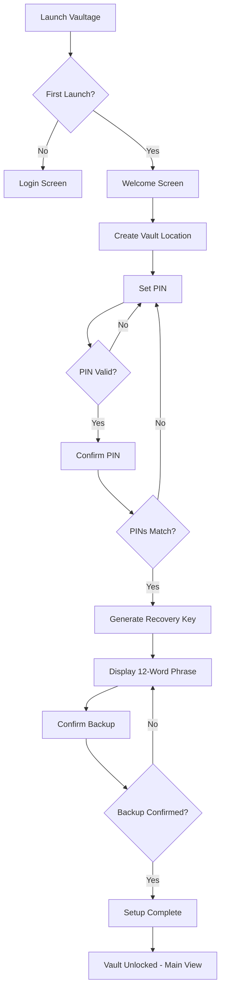
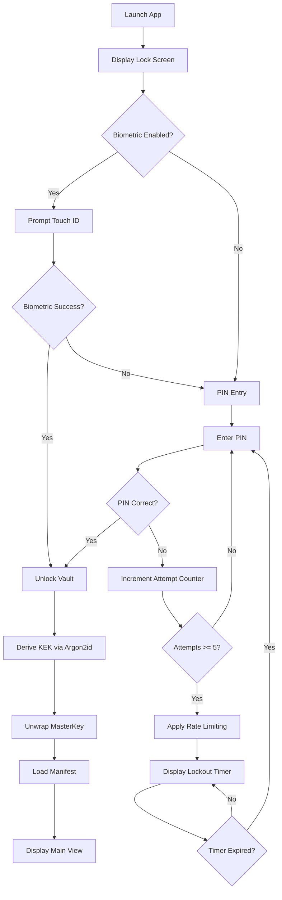
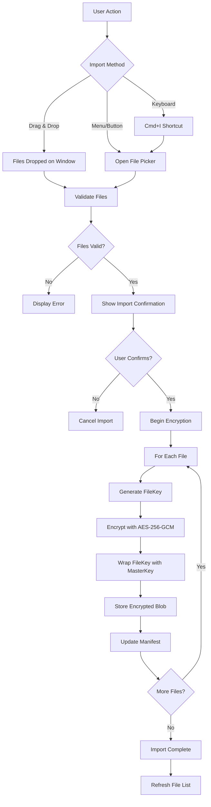
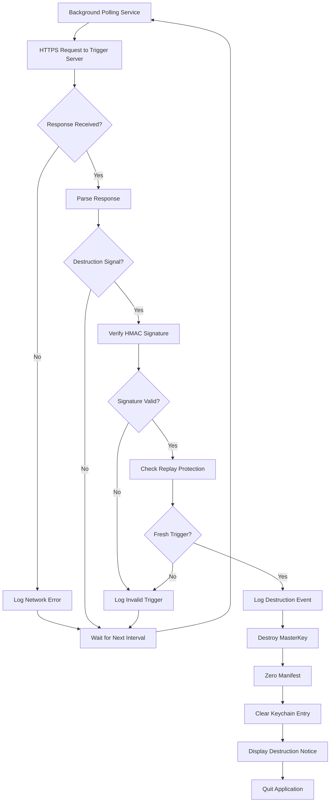
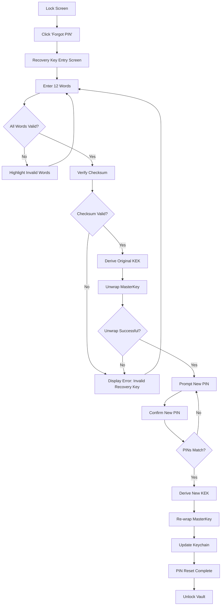
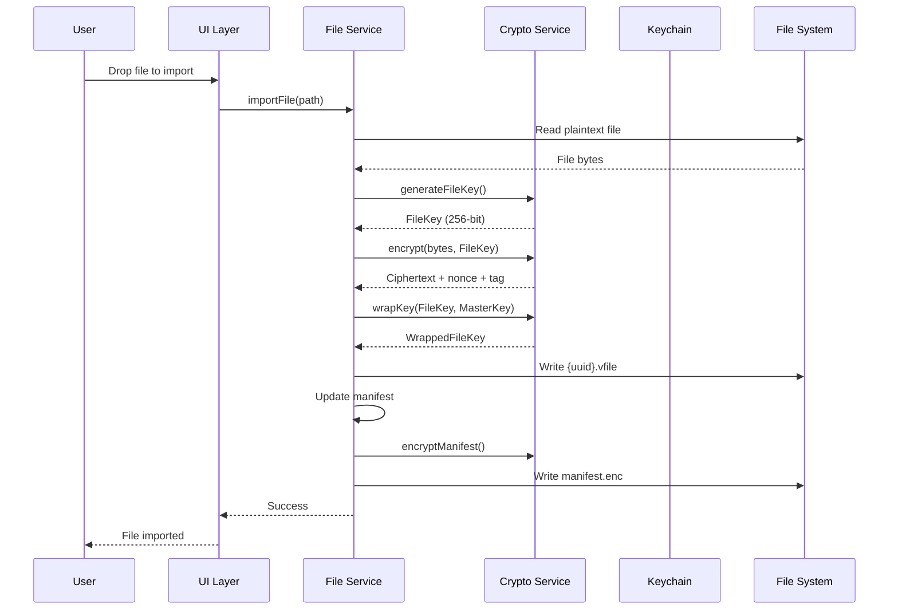
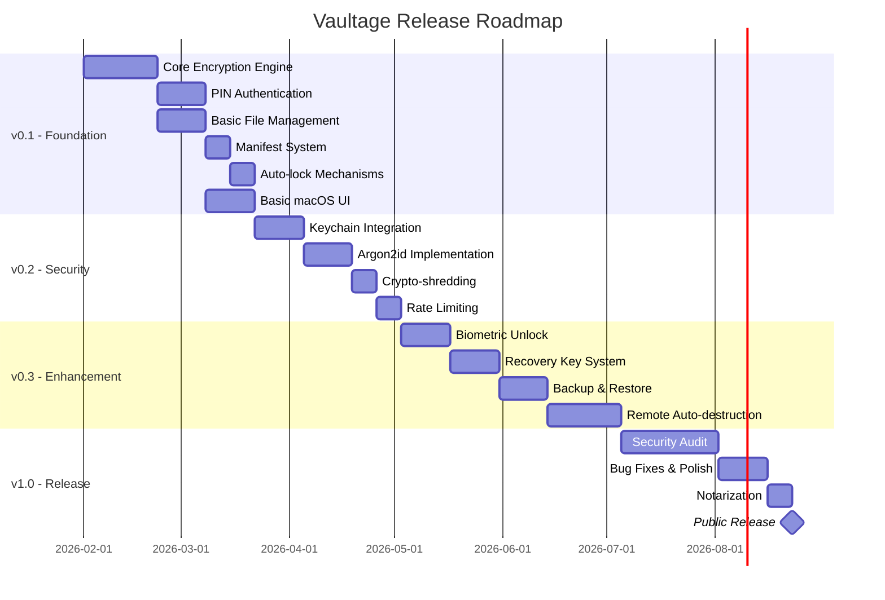

# Vaultage - Product Requirements Document

**Version:** 1.0  
**Author:** Matrix Agent  
**Product Owner:** Enzo (enzomarc237)  
**Last Updated:** 2026-01-28  
**Status:** Draft

---

## Table of Contents

1. [Executive Summary](#1-executive-summary)
2. [Product Overview](#2-product-overview)
3. [User Personas](#3-user-personas)
4. [Functional Requirements](#4-functional-requirements)
5. [Non-Functional Requirements](#5-non-functional-requirements)
6. [User Flows](#6-user-flows)
7. [Data Architecture](#7-data-architecture)
8. [Security Architecture](#8-security-architecture)
9. [Technical Architecture](#9-technical-architecture)
10. [Release Roadmap](#10-release-roadmap)
11. [Success Metrics & KPIs](#11-success-metrics--kpis)
12. [Risks & Mitigations](#12-risks--mitigations)
13. [Appendix](#13-appendix)

---

## 1. Executive Summary

### 1.1 Product Vision

Vaultage is a professional-grade encrypted file vault for macOS that provides journalists, attorneys, security researchers, and privacy-conscious professionals with military-grade file protection without compromising usability.

### 1.2 Value Proposition

**For** privacy-conscious professionals who handle sensitive documents,  
**Vaultage** is a macOS desktop application  
**that** provides AES-256-GCM encryption with verifiable security architecture,  
**unlike** generic cloud storage or basic encryption tools,  
**our product** offers per-file encryption, remote auto-destruction, and crypto-shredding with zero-knowledge architecture.

### 1.3 Key Differentiators

| Differentiator | Description |
|----------------|-------------|
| **Per-File Encryption** | Each file encrypted with unique key, limiting breach impact |
| **Crypto-Shredding** | Secure deletion by destroying wrapped keys, not overwriting data |
| **Remote Auto-Destruction** | HTTPS-triggered vault destruction for emergency scenarios |
| **Verifiable Security** | Open cryptographic design, third-party auditable |
| **Native macOS Experience** | Full integration with Keychain, Touch ID, and system tray |

### 1.4 Project Scope

**In Scope:**
- Local encrypted file storage on macOS
- PIN and biometric authentication
- Secure file deletion and auto-destruction
- Backup and recovery mechanisms

**Out of Scope (v1.0):**
- Cloud synchronization
- Multi-device sync
- File sharing between users
- iOS/Windows/Linux versions

---

## 2. Product Overview

### 2.1 Problem Statement

Professionals handling sensitive information face significant challenges:

1. **Inadequate Protection**: Standard macOS FileVault encrypts the entire disk but doesn't protect against logged-in threats or insider access
2. **Cloud Trust Issues**: Cloud storage requires trusting third parties with encryption keys
3. **No Emergency Destruction**: Existing solutions lack remote wipe capabilities for emergency scenarios
4. **Forensic Vulnerability**: Deleted files remain recoverable without proper crypto-shredding
5. **Complex Tools**: Enterprise solutions are overly complex for individual professionals

### 2.2 Solution

Vaultage provides a dedicated encrypted container with:

- **Zero-Knowledge Architecture**: Only the user holds decryption capability
- **Defense in Depth**: Multiple encryption layers with isolated key management
- **Emergency Protocols**: Remote destruction and auto-lock mechanisms
- **Usability Focus**: Native macOS UI with biometric convenience

### 2.3 Target Market

| Segment | Size | Priority |
|---------|------|----------|
| Investigative Journalists | ~50,000 (US) | Primary |
| IP/Corporate Attorneys | ~200,000 (US) | Primary |
| Security Researchers | ~100,000 (Global) | Secondary |
| Privacy-Conscious Professionals | ~2M (US) | Secondary |

### 2.4 Platform & Technology

| Aspect | Specification |
|--------|---------------|
| Platform | macOS Desktop Application |
| Framework | Flutter + Dart |
| Cryptography | Rust FFI (optional) / PointyCastle |
| UI Framework | macos_ui package |
| Minimum OS | macOS 10.15 (Catalina) |
| Maximum OS | macOS 15.x (Sequoia) |

---

## 3. User Personas

### 3.1 Primary Persona: Sarah Chen - Investigative Journalist

**Demographics:**
- Age: 34
- Location: Washington D.C.
- Occupation: Senior Investigative Reporter, Major News Outlet

**Background:**
Sarah investigates corporate fraud and government corruption. She regularly receives confidential documents from sources who risk their careers and safety.

**Goals:**
- Protect source identities and documents from subpoenas
- Quickly destroy evidence if device is seized
- Access files quickly under deadline pressure

**Pain Points:**
- Current solutions require technical expertise
- No reliable remote destruction option
- Worry about forensic recovery of deleted files

**Quote:** *"If my sources are exposed, lives could be ruined. I need encryption I can trust and verify."*

**Success Criteria:**
- Unlock vault in under 2 seconds
- Trigger remote destruction from any device
- Confidence in cryptographic implementation

---

### 3.2 Primary Persona: Michael Torres - IP Attorney

**Demographics:**
- Age: 47
- Location: San Francisco
- Occupation: Partner, IP Law Firm

**Background:**
Michael handles patent litigation for tech companies. Client documents include trade secrets worth billions.

**Goals:**
- Maintain attorney-client privilege
- Meet compliance requirements (ABA, state bar)
- Segregate client files with individual encryption

**Pain Points:**
- Firm IT policies don't cover local device security adequately
- Fear of laptop theft at conferences/travel
- Need audit trail for compliance

**Quote:** *"A breach wouldn't just hurt my client - it would end my career and expose the firm to malpractice."*

**Success Criteria:**
- Per-file encryption for client segregation
- Automatic lock on device sleep
- Exportable audit logs

---

### 3.3 Secondary Persona: Dr. Alex Rivera - Security Researcher

**Demographics:**
- Age: 29
- Location: Boston
- Occupation: PhD Candidate, Cybersecurity

**Background:**
Alex researches vulnerability disclosure and handles proof-of-concept exploits that could be dangerous if leaked.

**Goals:**
- Store PoC code securely before coordinated disclosure
- Verify cryptographic implementation personally
- Demonstrate secure practices to research subjects

**Pain Points:**
- Distrusts closed-source security tools
- Needs to verify crypto parameters
- Academic budget constraints

**Quote:** *"I won't use any crypto I can't audit. Show me the implementation or I'll build my own."*

**Success Criteria:**
- Transparent cryptographic design
- Configurable security parameters
- Open-source or auditable codebase

---

### 3.4 Secondary Persona: Elena Vasquez - Corporate Executive

**Demographics:**
- Age: 52
- Location: New York
- Occupation: CFO, Mid-size Corporation

**Background:**
Elena handles M&A documents, board materials, and financial projections that could move stock prices if leaked.

**Goals:**
- Simple, reliable protection without IT involvement
- Quick access during board meetings
- Peace of mind during travel

**Pain Points:**
- Not technically sophisticated
- Finds existing tools intimidating
- Worried about forgetting passwords

**Quote:** *"I just need it to work. If I have to call IT every time, I won't use it."*

**Success Criteria:**
- Touch ID unlock
- Recovery key for forgotten PIN
- Setup in under 5 minutes

---

## 4. Functional Requirements

### 4.1 Core Encryption Features

| ID | Requirement | Priority | Description | Acceptance Criteria |
|----|-------------|----------|-------------|---------------------|
| FR-ENC-001 | AES-256-GCM Encryption | P0 | All files encrypted using AES-256-GCM AEAD | - 256-bit key size verified<br>- GCM mode with 96-bit nonce<br>- Authentication tag validated on decrypt |
| FR-ENC-002 | Per-File Key Generation | P0 | Each file receives unique encryption key | - Keys generated via CSPRNG<br>- No key reuse between files<br>- Key independence verified |
| FR-ENC-003 | Key Wrapping | P0 | File keys wrapped with MasterKey using AES-KW | - RFC 3394 compliance<br>- Wrapped keys stored in manifest<br>- Unwrap fails gracefully on wrong MasterKey |
| FR-ENC-004 | Nonce Management | P0 | Unique nonces for every encryption operation | - 96-bit random nonces<br>- No nonce reuse detection<br>- Nonce stored with ciphertext |
| FR-ENC-005 | Encryption Throughput | P1 | Minimum 100 MB/s on Apple Silicon | - Benchmark on M1 baseline<br>- Large file streaming support<br>- Progress indication for >10MB files |

### 4.2 Authentication & Access Control

| ID | Requirement | Priority | Description | Acceptance Criteria |
|----|-------------|----------|-------------|---------------------|
| FR-AUTH-001 | PIN Authentication | P0 | 6-12 digit configurable PIN | - Length configurable at setup<br>- Numeric input only<br>- PIN strength indicator |
| FR-AUTH-002 | Argon2id KDF | P0 | Derive KEK from PIN using Argon2id | - Memory cost: ≥64MB<br>- Time cost: ≥1 second<br>- Salt: 128-bit random |
| FR-AUTH-003 | Rate Limiting | P0 | Exponential backoff after failed attempts | - 5 attempts before lockout<br>- Backoff: 30s, 1m, 5m, 15m, 1h<br>- Attempt counter persisted |
| FR-AUTH-004 | Biometric Unlock | P1 | Touch ID / Face ID integration | - LocalAuthentication framework<br>- Fallback to PIN always available<br>- Biometric optional, not required |
| FR-AUTH-005 | Auto-Lock on Idle | P0 | Lock vault after configurable idle period | - Default: 5 minutes<br>- Range: 1-60 minutes<br>- Timer resets on interaction |
| FR-AUTH-006 | Auto-Lock on Unfocus | P0 | Lock when app loses focus | - Configurable (on/off)<br>- Default: enabled<br>- Immediate lock on app hide |
| FR-AUTH-007 | Session Management | P1 | Secure session with memory protection | - MasterKey in memory only when unlocked<br>- Zeroization on lock<br>- No swap/hibernation leakage |

### 4.3 Storage & File Management

| ID | Requirement | Priority | Description | Acceptance Criteria |
|----|-------------|----------|-------------|---------------------|
| FR-STOR-001 | File Import | P0 | Add files to vault via drag-drop or file picker | - macOS native file picker<br>- Drag-drop from Finder<br>- Progress indication |
| FR-STOR-002 | File Export | P0 | Decrypt and export files to filesystem | - User selects destination<br>- Original filename preserved<br>- Metadata restoration |
| FR-STOR-003 | Manifest Management | P0 | Encrypted file list with metadata | - AEAD-protected manifest<br>- File UUID, name, size, dates<br>- Atomic updates |
| FR-STOR-004 | File Preview | P2 | In-app preview for common formats | - Images: JPEG, PNG, GIF<br>- Documents: PDF, TXT<br>- Preview in memory only |
| FR-STOR-005 | Folder Organization | P1 | Virtual folder structure within vault | - Nested folders<br>- Drag-drop reorganization<br>- Folder metadata in manifest |
| FR-STOR-006 | Search | P1 | Search files by name | - Real-time filtering<br>- Case-insensitive<br>- Metadata search (not content) |
| FR-STOR-007 | Large File Support | P1 | Handle files up to 10GB | - Streaming encryption<br>- Chunked processing<br>- Memory-efficient |

### 4.4 Secure Deletion (Crypto-Shredding)

| ID | Requirement | Priority | Description | Acceptance Criteria |
|----|-------------|----------|-------------|---------------------|
| FR-DEL-001 | Crypto-Shred File | P0 | Delete file by destroying wrapped key | - Key removed from manifest<br>- Encrypted blob optionally retained<br>- Immediate key zeroization |
| FR-DEL-002 | Secure Blob Removal | P1 | Optionally overwrite encrypted file | - Single-pass zero overwrite<br>- File unlinked after overwrite<br>- SSD TRIM consideration noted |
| FR-DEL-003 | Vault Destruction | P0 | Complete vault destruction | - MasterKey destroyed<br>- All wrapped keys destroyed<br>- Manifest zeroed |
| FR-DEL-004 | Deletion Confirmation | P0 | User confirmation for destructive actions | - Modal confirmation dialog<br>- Type-to-confirm for vault destruction<br>- No accidental deletion |

### 4.5 Remote Auto-Destruction

| ID | Requirement | Priority | Description | Acceptance Criteria |
|----|-------------|----------|-------------|---------------------|
| FR-RAD-001 | Destruction Trigger Server | P1 | Configure remote trigger endpoint | - HTTPS URL configuration<br>- TLS 1.3 required<br>- Certificate pinning |
| FR-RAD-002 | Polling Mechanism | P1 | Periodic check for destruction signal | - Configurable interval (1-60 min)<br>- Background polling<br>- Network failure tolerance |
| FR-RAD-003 | HMAC Authentication | P1 | Verify trigger authenticity | - HMAC-SHA256 signed triggers<br>- Shared secret in Keychain<br>- Replay attack prevention |
| FR-RAD-004 | Destruction Execution | P1 | Execute vault destruction on valid trigger | - Immediate MasterKey destruction<br>- Audit log entry (pre-destruction)<br>- Application quit |
| FR-RAD-005 | Trigger Management UI | P1 | User interface for remote trigger setup | - Add/remove trigger servers<br>- Test connection<br>- View trigger status |

### 4.6 UI/UX Requirements

| ID | Requirement | Priority | Description | Acceptance Criteria |
|----|-------------|----------|-------------|---------------------|
| FR-UI-001 | Native macOS Design | P0 | Use macos_ui package for native look | - macOS design language<br>- Dark/light mode support<br>- Accessibility compliance |
| FR-UI-002 | System Tray Integration | P1 | Menu bar icon for quick access | - Lock/unlock status indicator<br>- Quick lock action<br>- Recent files (optional) |
| FR-UI-003 | Onboarding Flow | P0 | First-time setup wizard | - Vault creation<br>- PIN setup with confirmation<br>- Recovery key generation/backup |
| FR-UI-004 | File Browser | P0 | Main interface for file management | - List and grid views<br>- Sort by name/date/size<br>- Context menu actions |
| FR-UI-005 | Settings Panel | P0 | Configuration interface | - Security settings<br>- Auto-lock configuration<br>- Remote trigger setup |
| FR-UI-006 | Progress Indicators | P0 | Visual feedback for operations | - File encryption progress<br>- Import/export progress<br>- Cancellation support |
| FR-UI-007 | Keyboard Shortcuts | P1 | Power user keyboard navigation | - Cmd+L: Lock vault<br>- Cmd+I: Import files<br>- Cmd+F: Search |

### 4.7 Backup & Recovery

| ID | Requirement | Priority | Description | Acceptance Criteria |
|----|-------------|----------|-------------|---------------------|
| FR-BAK-001 | Recovery Key Generation | P0 | 12-word BIP39-style recovery phrase | - 128-bit entropy<br>- Standard word list<br>- Checksum validation |
| FR-BAK-002 | Recovery Key Display | P0 | Secure display of recovery key | - One-time display at setup<br>- Copy-to-clipboard option<br>- Print option |
| FR-BAK-003 | PIN Recovery | P0 | Reset PIN using recovery key | - Verify recovery phrase<br>- Set new PIN<br>- Re-wrap MasterKey |
| FR-BAK-004 | Vault Backup | P1 | Export encrypted vault backup | - Single archive file<br>- Includes all encrypted data<br>- Backup verification |
| FR-BAK-005 | Vault Restore | P1 | Restore vault from backup | - Validate backup integrity<br>- Restore to new location<br>- PIN required for restore |

---

## 5. Non-Functional Requirements

### 5.1 Performance Requirements

| ID | Requirement | Target | Measurement |
|----|-------------|--------|-------------|
| NFR-PERF-001 | Encryption Throughput | ≥100 MB/s | Benchmark on M1 Mac |
| NFR-PERF-002 | Unlock Time | <2 seconds | From PIN entry to unlocked |
| NFR-PERF-003 | App Launch Time | <3 seconds | Cold start to login screen |
| NFR-PERF-004 | Memory Usage (Idle) | <100 MB | Locked state |
| NFR-PERF-005 | Memory Usage (Active) | <200 MB | 1000-file vault unlocked |
| NFR-PERF-006 | File List Load | <1 second | 1000 files in manifest |

### 5.2 Security Requirements

| ID | Requirement | Description |
|----|-------------|-------------|
| NFR-SEC-001 | Encryption Standard | AES-256-GCM (NIST approved) |
| NFR-SEC-002 | Key Derivation | Argon2id with ≥64MB memory, ≥1s time |
| NFR-SEC-003 | Random Generation | Platform CSPRNG only |
| NFR-SEC-004 | Key Storage | macOS Keychain for wrapped MasterKey |
| NFR-SEC-005 | Memory Protection | Zeroization after use, no swap |
| NFR-SEC-006 | Transport Security | TLS 1.3 with certificate pinning |
| NFR-SEC-007 | No Telemetry | Zero data collection or transmission |
| NFR-SEC-008 | Audit Logging | Non-sensitive operation logs |

### 5.3 Reliability Requirements

| ID | Requirement | Target |
|----|-------------|--------|
| NFR-REL-001 | Crash Rate | <0.1% of sessions |
| NFR-REL-002 | Data Integrity | Zero data loss from app issues |
| NFR-REL-003 | Atomic Operations | All file operations atomic |
| NFR-REL-004 | Graceful Degradation | Functional without network |

### 5.4 Compatibility Requirements

| ID | Requirement | Specification |
|----|-------------|---------------|
| NFR-COMP-001 | Minimum macOS | 10.15 (Catalina) |
| NFR-COMP-002 | Maximum macOS | 15.x (Sequoia) |
| NFR-COMP-003 | Architecture | Universal Binary (Intel + Apple Silicon) |
| NFR-COMP-004 | Notarization | Apple notarized for Gatekeeper |

### 5.5 Usability Requirements

| ID | Requirement | Target |
|----|-------------|--------|
| NFR-USE-001 | Setup Time | <5 minutes for new user |
| NFR-USE-002 | Learning Curve | Core features usable without documentation |
| NFR-USE-003 | Accessibility | WCAG 2.1 AA compliance |
| NFR-USE-004 | Localization | English (v1.0), extensible for i18n |

---

## 6. User Flows

### 6.1 First-Time Setup Flow



**Flow Description:**

1. **Welcome Screen**: Introduction to Vaultage with brief value proposition
2. **Vault Location**: User selects directory for vault storage (default: ~/Documents/Vaultage)
3. **PIN Creation**: User enters 6-12 digit PIN with strength indicator
4. **PIN Confirmation**: Re-enter PIN to prevent typos
5. **Recovery Key**: System generates and displays 12-word BIP39 phrase
6. **Backup Confirmation**: User confirms they've saved the recovery key
7. **Main View**: Vault is unlocked and ready for file import

---

### 6.2 Authentication Flow



**Key Experience Points:**

- **Biometric Prompt**: Immediate Touch ID prompt for fastest access
- **PIN Fallback**: Always available, clearly visible option
- **Rate Limiting Feedback**: Clear communication of lockout duration
- **Unlock Feedback**: Visual confirmation of successful unlock (<2s)

---

### 6.3 File Import Flow



---

### 6.4 Remote Auto-Destruction Flow



---

### 6.5 PIN Recovery Flow



---

## 7. Data Architecture

### 7.1 Vault Directory Structure

```
vault-root/
├── manifest.enc          # AEAD-encrypted file metadata
├── config.enc            # AEAD-encrypted settings
├── files/
│   ├── {uuid-1}.vfile    # Encrypted file blob
│   ├── {uuid-2}.vfile
│   └── ...
├── logs/
│   ├── audit.log         # Non-sensitive operation log
│   └── audit.log.1       # Rotated logs
└── .vaultage             # Vault marker file (version info)
```

### 7.2 Manifest Schema

```json
{
  "version": "1.0",
  "created": "2026-01-28T05:15:56Z",
  "modified": "2026-01-28T05:15:56Z",
  "files": [
    {
      "id": "550e8400-e29b-41d4-a716-446655440000",
      "name": "confidential-report.pdf",
      "originalPath": "/Users/user/Documents/confidential-report.pdf",
      "size": 2048576,
      "mimeType": "application/pdf",
      "createdAt": "2026-01-28T05:15:56Z",
      "modifiedAt": "2026-01-28T05:15:56Z",
      "importedAt": "2026-01-28T05:15:56Z",
      "wrappedKey": "base64-encoded-wrapped-file-key",
      "nonce": "base64-encoded-nonce",
      "tags": ["work", "confidential"],
      "folder": "/Projects/2026"
    }
  ],
  "folders": [
    {
      "path": "/Projects",
      "createdAt": "2026-01-28T05:15:56Z"
    },
    {
      "path": "/Projects/2026",
      "createdAt": "2026-01-28T05:15:56Z"
    }
  ],
  "checksum": "sha256-of-manifest-content"
}
```

### 7.3 Encrypted File Format (.vfile)

```
+------------------+
|  Magic Bytes (4) |  "VLTG"
+------------------+
|  Version (2)     |  0x0001
+------------------+
|  Nonce (12)      |  96-bit GCM nonce
+------------------+
|  Ciphertext (N)  |  AES-256-GCM encrypted content
+------------------+
|  Auth Tag (16)   |  GCM authentication tag
+------------------+
```

### 7.4 Configuration Schema

```json
{
  "version": "1.0",
  "security": {
    "autoLockIdleMinutes": 5,
    "autoLockOnUnfocus": true,
    "biometricEnabled": false,
    "pinLength": 6
  },
  "remoteDestruction": {
    "enabled": false,
    "servers": [],
    "pollIntervalMinutes": 5
  },
  "ui": {
    "theme": "system",
    "defaultView": "list",
    "showHiddenFiles": false
  },
  "kdf": {
    "algorithm": "argon2id",
    "memoryCostKB": 65536,
    "timeCost": 3,
    "parallelism": 4
  }
}
```

---

## 8. Security Architecture

### 8.1 Threat Model

| Threat | Likelihood | Impact | Mitigation |
|--------|------------|--------|------------|
| **Device Theft (Locked)** | Medium | High | Full disk encryption assumed; vault adds defense-in-depth |
| **Device Theft (Unlocked)** | Low | Critical | Auto-lock on idle/unfocus; memory zeroization |
| **Malware/Keylogger** | Medium | Critical | Out of scope for v1.0; recommend endpoint protection |
| **Forensic Analysis** | Medium | High | Crypto-shredding; no plaintext on disk |
| **Subpoena/Legal Compulsion** | Low | High | Remote destruction; recovery key separate storage |
| **Brute Force Attack** | High | Critical | Argon2id KDF; rate limiting; key stretching |
| **Memory Extraction** | Low | Critical | Memory zeroization; short session windows |
| **Network MITM** | Medium | Medium | TLS 1.3; certificate pinning |
| **Replay Attacks** | Medium | Medium | Nonce management; HMAC timestamps |

### 8.2 Cryptographic Design

```
┌─────────────────────────────────────────────────────────────┐
│                     KEY HIERARCHY                            │
├─────────────────────────────────────────────────────────────┤
│                                                              │
│  User PIN ──► Argon2id ──► KEK (Key Encryption Key)         │
│                              │                               │
│                              ▼                               │
│              ┌───────────────────────────────┐               │
│              │    macOS Keychain            │               │
│              │  ┌─────────────────────────┐  │               │
│              │  │  Wrapped MasterKey     │  │               │
│              │  │  (AES-KW encrypted)    │  │               │
│              │  └─────────────────────────┘  │               │
│              └───────────────────────────────┘               │
│                              │                               │
│                    KEK unwraps                               │
│                              ▼                               │
│                      MasterKey (256-bit)                     │
│                              │                               │
│              ┌───────────────┼───────────────┐               │
│              │               │               │               │
│              ▼               ▼               ▼               │
│         ┌────────┐     ┌────────┐     ┌────────┐            │
│         │FileKey1│     │FileKey2│     │FileKeyN│            │
│         │(wrapped)│     │(wrapped)│     │(wrapped)│           │
│         └────┬───┘     └────┬───┘     └────┬───┘            │
│              │              │              │                 │
│              ▼              ▼              ▼                 │
│         ┌────────┐     ┌────────┐     ┌────────┐            │
│         │ File 1 │     │ File 2 │     │ File N │            │
│         │  .vfile│     │  .vfile│     │  .vfile│            │
│         └────────┘     └────────┘     └────────┘            │
│                                                              │
└─────────────────────────────────────────────────────────────┘
```

### 8.3 Cryptographic Specifications

| Component | Algorithm | Parameters |
|-----------|-----------|------------|
| File Encryption | AES-256-GCM | 256-bit key, 96-bit nonce, 128-bit tag |
| Key Wrapping | AES-KW | RFC 3394, 256-bit KEK |
| KDF | Argon2id | 64MB memory, 3 iterations, 4 parallelism |
| HMAC | HMAC-SHA256 | 256-bit key |
| Random Generation | SecRandomCopyBytes | Platform CSPRNG |
| Recovery Key | BIP39 | 128-bit entropy, 12 words |

### 8.4 Security Controls

| Control | Implementation |
|---------|----------------|
| **Authentication** | PIN + optional biometric, rate-limited |
| **Authorization** | Single-user, local vault |
| **Encryption at Rest** | All sensitive data AES-256-GCM encrypted |
| **Encryption in Transit** | TLS 1.3 for remote triggers |
| **Key Management** | Hierarchical keys, Keychain storage |
| **Secure Deletion** | Crypto-shredding (key destruction) |
| **Audit Logging** | Non-sensitive operation logs |
| **Memory Protection** | Zeroization, no swap |

---

## 9. Technical Architecture

### 9.1 System Components

```
┌─────────────────────────────────────────────────────────────┐
│                      VAULTAGE APPLICATION                    │
├─────────────────────────────────────────────────────────────┤
│  ┌─────────────────────────────────────────────────────┐    │
│  │                   PRESENTATION LAYER                 │    │
│  │  ┌──────────┐ ┌──────────┐ ┌──────────┐ ┌────────┐  │    │
│  │  │Lock Screen│ │File Browser│ │Settings │ │Onboard │  │    │
│  │  └──────────┘ └──────────┘ └──────────┘ └────────┘  │    │
│  │                    macos_ui widgets                  │    │
│  └─────────────────────────────────────────────────────┘    │
│                            │                                 │
│  ┌─────────────────────────────────────────────────────┐    │
│  │                   APPLICATION LAYER                  │    │
│  │  ┌──────────┐ ┌──────────┐ ┌──────────┐ ┌────────┐  │    │
│  │  │Auth Service│ │File Service│ │Config Svc│ │Backup │  │    │
│  │  └──────────┘ └──────────┘ └──────────┘ └────────┘  │    │
│  │                State Management (Provider/Riverpod)  │    │
│  └─────────────────────────────────────────────────────┘    │
│                            │                                 │
│  ┌─────────────────────────────────────────────────────┐    │
│  │                    DOMAIN LAYER                      │    │
│  │  ┌──────────┐ ┌──────────┐ ┌──────────┐ ┌────────┐  │    │
│  │  │Vault Entity│ │File Entity│ │Key Entity│ │Manifest│  │    │
│  │  └──────────┘ └──────────┘ └──────────┘ └────────┘  │    │
│  └─────────────────────────────────────────────────────┘    │
│                            │                                 │
│  ┌─────────────────────────────────────────────────────┐    │
│  │                 INFRASTRUCTURE LAYER                 │    │
│  │  ┌──────────┐ ┌──────────┐ ┌──────────┐ ┌────────┐  │    │
│  │  │Crypto Svc │ │Keychain  │ │File I/O  │ │Network │  │    │
│  │  │(Rust FFI) │ │ Plugin   │ │          │ │        │  │    │
│  │  └──────────┘ └──────────┘ └──────────┘ └────────┘  │    │
│  └─────────────────────────────────────────────────────┘    │
│                            │                                 │
├─────────────────────────────────────────────────────────────┤
│                      macOS PLATFORM                          │
│  ┌──────────┐ ┌──────────┐ ┌──────────┐ ┌──────────────┐    │
│  │ Keychain │ │ Secure   │ │LocalAuth │ │ File System  │    │
│  │ Services │ │ Enclave  │ │(Touch ID)│ │              │    │
│  └──────────┘ └──────────┘ └──────────┘ └──────────────┘    │
└─────────────────────────────────────────────────────────────┘
```

### 9.2 Data Flow - File Encryption



### 9.3 Technology Stack

| Layer | Technology | Purpose |
|-------|------------|---------|
| UI Framework | Flutter + macos_ui | Native macOS appearance |
| State Management | Riverpod | Reactive state, dependency injection |
| Cryptography | Rust FFI / PointyCastle | AES-256-GCM, Argon2id |
| Keychain | flutter_secure_storage | Wrapped key storage |
| Biometrics | local_auth | Touch ID integration |
| File I/O | dart:io + path_provider | File system operations |
| Networking | dio + http | Remote trigger polling |
| Logging | logger | Audit logging |

### 9.4 Build & Distribution

| Aspect | Specification |
|--------|---------------|
| Build System | Flutter build macos |
| Code Signing | Apple Developer ID |
| Notarization | Apple Notary Service |
| Distribution | Direct download + Mac App Store (future) |
| Updates | Sparkle framework (planned) |

---

## 10. Release Roadmap

### 10.1 Version Timeline



### 10.2 Release Details

#### v0.1 - Foundation (MVP)

**Target Date:** Q1 2026

**Features:**
- Core AES-256-GCM encryption engine
- PIN-based authentication (basic)
- File import/export with encryption
- Encrypted manifest system
- Auto-lock on idle and unfocus
- Basic macOS native UI
- File browser (list view)

**Success Criteria:**
- Encrypt/decrypt 100MB file successfully
- PIN unlock works reliably
- No plaintext data on disk

---

#### v0.2 - Security Hardening

**Target Date:** Q2 2026

**Features:**
- macOS Keychain integration for wrapped MasterKey
- Argon2id KDF implementation
- Crypto-shredding for secure deletion
- Exponential backoff rate limiting
- Enhanced error handling

**Success Criteria:**
- Argon2id takes ≥1 second
- Rate limiting activates after 5 attempts
- Deleted file keys unrecoverable

---

#### v0.3 - Enhanced Security & UX

**Target Date:** Q3 2026

**Features:**
- Touch ID / Face ID biometric unlock
- 12-word recovery key generation
- Vault backup and restore
- Remote auto-destruction system
- System tray integration
- Folder organization

**Success Criteria:**
- Biometric unlock <500ms
- Recovery key restores access
- Remote trigger destroys vault

---

#### v1.0 - Public Release

**Target Date:** Q4 2026

**Features:**
- Third-party security audit completion
- All critical/high findings remediated
- Apple notarization
- Polished onboarding experience
- Documentation and help system

**Success Criteria:**
- Pass security audit
- Zero known critical vulnerabilities
- App Store ready (optional)

---

## 11. Success Metrics & KPIs

### 11.1 Acquisition Metrics

| Metric | Target | Timeframe |
|--------|--------|-----------|
| Total Downloads | 50,000 | 12 months post-launch |
| Active Users (MAU) | 10,000 | 6 months post-launch |
| Conversion (Download → Active) | >40% | Ongoing |

### 11.2 Engagement Metrics

| Metric | Target | Measurement |
|--------|--------|-------------|
| Daily Active Users | 2,000 | DAU/MAU >20% |
| Files per Vault (avg) | >20 | Indicates real usage |
| Session Duration (avg) | >3 min | Meaningful engagement |
| Retention (Day 7) | >50% | First week retention |
| Retention (Day 30) | >30% | Month retention |

### 11.3 Security Metrics

| Metric | Target | Timeframe |
|--------|--------|-----------|
| CVEs Discovered | 0 | First 12 months |
| Security Audit Score | Pass | Pre-launch |
| Bug Bounty Critical Findings | 0 | Ongoing |
| Mean Time to Patch (Critical) | <48 hours | Ongoing |

### 11.4 Quality Metrics

| Metric | Target | Source |
|--------|--------|--------|
| App Store Rating | ≥4.5 stars | App Store (if listed) |
| Crash-Free Sessions | >99.9% | Analytics |
| Support Tickets (per 1000 users) | <10/month | Support system |
| NPS Score | >50 | User surveys |

### 11.5 Business Metrics (Future)

| Metric | Target | Notes |
|--------|--------|-------|
| Premium Conversion | >5% | If freemium model adopted |
| Revenue (ARR) | $100K | Year 2 target |
| Customer Acquisition Cost | <$10 | Marketing efficiency |

---

## 12. Risks & Mitigations

### 12.1 Technical Risks

| Risk | Probability | Impact | Mitigation |
|------|-------------|--------|------------|
| **Cryptographic Implementation Flaw** | Medium | Critical | Use audited libraries; third-party security audit; bug bounty |
| **Performance on Large Files** | Medium | Medium | Streaming encryption; chunked processing; performance testing |
| **macOS API Deprecation** | Low | Medium | Abstract platform dependencies; monitor Apple announcements |
| **Keychain Access Issues** | Medium | High | Graceful fallback; clear error messaging; alternative storage option |
| **Flutter/Dart Security Limitations** | Low | High | Rust FFI for crypto operations; memory management review |

### 12.2 Security Risks

| Risk | Probability | Impact | Mitigation |
|------|-------------|--------|------------|
| **Zero-Day Vulnerability** | Low | Critical | Defense in depth; rapid response plan; security monitoring |
| **Side-Channel Attacks** | Low | High | Constant-time operations; Rust FFI; security audit focus |
| **Supply Chain Attack** | Low | Critical | Dependency auditing; reproducible builds; SBOM |
| **Social Engineering (User)** | Medium | High | User education; clear security indicators; phishing warnings |

### 12.3 Business Risks

| Risk | Probability | Impact | Mitigation |
|------|-------------|--------|------------|
| **Limited Market Adoption** | Medium | High | Clear value proposition; target niche before expansion |
| **Competitor Entry** | Medium | Medium | Focus on verifiable security; open audit results |
| **Regulatory Changes** | Low | Medium | Monitor encryption regulations; legal review |
| **Negative Security Incident** | Low | Critical | Incident response plan; transparent communication |

### 12.4 Operational Risks

| Risk | Probability | Impact | Mitigation |
|------|-------------|--------|------------|
| **Key Developer Departure** | Medium | High | Documentation; code review; knowledge sharing |
| **Support Overwhelm** | Medium | Medium | Self-service documentation; community forums |
| **Infrastructure Costs (Remote Trigger)** | Low | Low | Serverless architecture; cost monitoring |

---

## 13. Appendix

### 13.1 Glossary

| Term | Definition |
|------|------------|
| **AEAD** | Authenticated Encryption with Associated Data - encryption that provides both confidentiality and integrity |
| **AES-256-GCM** | Advanced Encryption Standard with 256-bit key in Galois/Counter Mode |
| **AES-KW** | AES Key Wrap - RFC 3394 algorithm for encrypting cryptographic keys |
| **Argon2id** | Memory-hard key derivation function resistant to GPU/ASIC attacks |
| **BIP39** | Bitcoin Improvement Proposal 39 - standard for mnemonic recovery phrases |
| **Crypto-shredding** | Secure deletion by destroying encryption keys rather than overwriting data |
| **CSPRNG** | Cryptographically Secure Pseudo-Random Number Generator |
| **GCM** | Galois/Counter Mode - authenticated encryption mode for block ciphers |
| **HMAC** | Hash-based Message Authentication Code |
| **KDF** | Key Derivation Function - derives cryptographic keys from passwords/PINs |
| **KEK** | Key Encryption Key - key used to encrypt other keys |
| **MasterKey** | Root encryption key that protects all file keys |
| **Nonce** | Number used once - ensures encryption uniqueness |
| **Secure Enclave** | Apple hardware security module for key storage |
| **TLS** | Transport Layer Security - cryptographic protocol for network security |
| **Wrapped Key** | Encryption key that has been encrypted with another key |

### 13.2 References

1. **NIST SP 800-38D** - Recommendation for Block Cipher Modes of Operation: Galois/Counter Mode (GCM)
2. **RFC 3394** - Advanced Encryption Standard (AES) Key Wrap Algorithm
3. **RFC 9106** - Argon2 Memory-Hard Function for Password Hashing
4. **BIP-0039** - Mnemonic code for generating deterministic keys
5. **Apple Developer Documentation** - Keychain Services, LocalAuthentication
6. **Flutter Documentation** - macos_ui package, flutter_secure_storage
7. **OWASP** - Cryptographic Storage Cheat Sheet

### 13.3 Document History

| Version | Date | Author | Changes |
|---------|------|--------|---------|
| 1.0 | 2026-01-28 | Matrix Agent | Initial PRD creation |

### 13.4 Approval

| Role | Name | Date | Signature |
|------|------|------|-----------|
| Product Owner | Enzo (enzomarc237) | | |
| Technical Lead | | | |
| Security Lead | | | |

---

*This document is confidential and intended for internal use only.*
